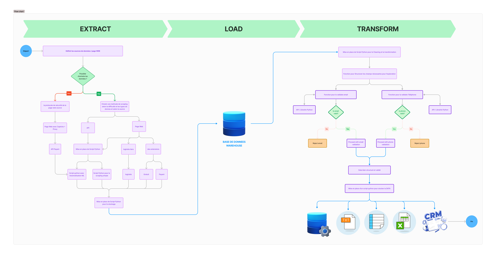

# 🧩 Datapull – ETL Workflow for B2B Lead Intelligence

This repository contains the **ETL (Extract, Transform, Load)** workflow component of **Datapull**, a large-scale, production-grade B2B lead intelligence platform managing over **3 million+ lead records**.

This ETL system is a critical foundation for orchestrating real-time lead generation, multi-step validation (email, phone), and B2B data enrichment from external APIs.

---

## 📌 Project Overview

The complete **Datapull** platform was built over 1.5 years and integrates tools like **Talend**, **Django**, **Streamlit**, and **SQL (OVH)**. This repository focuses specifically on the **ETL workflow**, which is responsible for:

- Extracting raw B2B lead data from diverse sources (e.g., APIs, CSV, databases)
- Cleaning and transforming the data (deduplication, normalization)
- Validating email addresses and phone numbers
- Loading structured data into a PostgreSQL database
- Triggering real-time updates to the frontend dashboards

---

 

## ⚙️ ETL Pipeline Stages

### 1. **Extract**

- Pull data from:
  - API sources (company registries, enrichment tools)
  - Uploaded CSV files
  - SQL-based lead pools
- Scheduled or event-driven jobs via **Talend** or Python scripts

### 2. **Transform**

- Clean and normalize company and contact data
- Standardize phone numbers (international format)
- Deduplicate entries using fuzzy matching
- Split full names into first/last names

### 3. **Validate**

- Email verification via 3rd-party API (e.g., NeverBounce or Hunter.io)
- Phone number validation using regex or API
- Flag invalid records and route them to a separate error log

### 4. **Load**

- Insert transformed and verified records into the **PostgreSQL database (OVH)**
- Track insert/update timestamps for auditability
- Trigger alerts or dashboards when batch is complete

---

## 🧰 Tech Stack

| Component    | Technology Used                  |
|--------------|----------------------------------|
| Workflow Orchestration | **Talend**, Python scripts |
| Data Transformation    | Python (Pandas, Regex, selinium)     |
| Validation APIs        | Email & phone validation APIs |
| Data Storage           | **SQL (OVH)**        |
| Monitoring             | Streamlit (Dashboard triggers), Logs |

---

## 📌 Use Cases

- CRM enrichment with verified lead data
- Automated B2B contact generation
- Quality scoring for marketing/sales teams
- Cleaning and ingestion pipeline for ML models

---

## 📈 Highlights

✔️ 3M+ lead records processed

✔️ End-to-end validation logic

✔️ Modular, scalable, and production-ready

✔️ Integrated with real-time dashboards

---

## 🧠 What I Learned

Building this ETL system helped me master:

- Data quality pipelines at scale
- Orchestration and modular code design
- Real-world API integration and validation logic
- Balancing performance and data integrity

